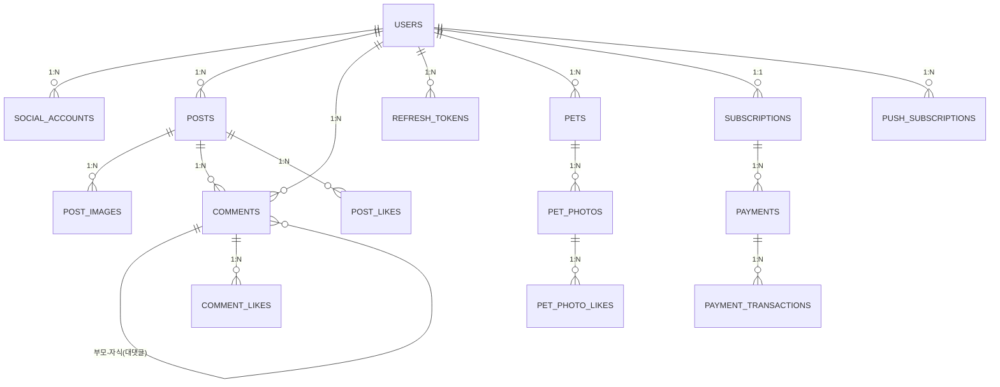

# ERD

## 원본
- Notion: https://app.notion.com/p/ERD-3ad73873401a80339ad9ea477bb75420

## 핵심 엔티티 관계

## 주요 엔티티 설명

| 엔티티 | PK | 주요 컬럼 | 비고 |
|--------|-----|-----------|------|
| USERS | id (Long) | username, password, nickname, email, profile_image_url, role, profile_layout | role: USER/ADMIN |
| SOCIAL_ACCOUNTS | id | provider, provider_id, user_id(FK) | Google OAuth2 |
| POSTS | id | title, content, category, view_count, user_id(FK) | category: QNA/BOAST |
| POST_IMAGES | id | image_url, post_id(FK) | 최대 5장 |
| COMMENTS | id | content, parent_id(FK self), post_id(FK), user_id(FK) | 대댓글은 parent_id 존재 |
| POST_LIKES | id | post_id(FK), user_id(FK) | UK(post_id, user_id) |
| COMMENT_LIKES | id | comment_id(FK), user_id(FK) | UK(comment_id, user_id) |
| PETS | id | pet_name, pet_type, pet_birthday, pet_intro, pet_image_url, user_id(FK) | 구독자 전용 |
| PET_PHOTOS | id | image_url, caption, like_count, pet_id(FK) | |
| PET_PHOTO_LIKES | id | photo_id(Long), user_id(Long) | primitive 컬럼 |
| SUBSCRIPTIONS | id | status, type, billing_key, user_id(FK) | status: ACTIVE/INACTIVE |
| PAYMENTS | id | status, amount, order_id, subscription_id(FK) | status: READY/PAID/FAILED |
| PAYMENT_TRANSACTIONS | id | transaction_id, status, payment_id(FK) | PortOne 거래 기록 |
| PUSH_SUBSCRIPTIONS | id | endpoint, p256dh, auth, user_id(FK) | VAPID Web Push |
| REFRESH_TOKENS | id | token_hash, user_id(FK), expires_at | |
