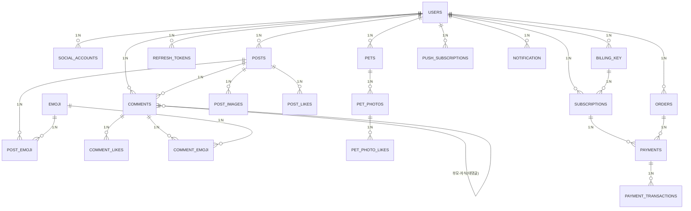

# ERD

## 원본
- Notion: https://app.notion.com/p/ERD-3ad73873401a80339ad9ea477bb75420

## 핵심 엔티티 관계

## 주요 엔티티 설명

| 엔티티 | PK | 주요 컬럼 | 비고 |
|--------|-----|-----------|------|
| USERS | id (Long) | username, password, nickname, profile_image_url, role, profile_layout, is_deleted | role: USER/ADMIN, password nullable(소셜 계정) |
| SOCIAL_ACCOUNTS | id | provider, provider_id, user_id(FK) | Google OAuth2 |
| POSTS | id | title, content, category, view_count, is_deleted, user_id(FK) | category: QNA/BOAST |
| POST_IMAGES | id | image_url, sort_order, post_id(FK) | 최대 5장 |
| COMMENTS | id | content, parent_id(FK self), post_id(FK), user_id(FK), is_deleted | 대댓글은 parent_id 존재 |
| POST_LIKES | id | post_id(FK), user_id(FK) | UK(post_id, user_id) |
| COMMENT_LIKES | id | comment_id(FK), user_id(FK) | UK(comment_id, user_id) |
| EMOJI | id | name, image_url, is_active | 구독자 전용 이모지 |
| POST_EMOJI | id | post_id(FK), emoji_id(FK) | |
| COMMENT_EMOJI | id | comment_id(FK), emoji_id(FK) | |
| PETS | id | pet_name, pet_type, pet_birthday, pet_intro, pet_image_url, user_id(FK) | 구독자 전용 |
| PET_PHOTOS | id | image_url, caption, like_count, pet_id(FK) | |
| PET_PHOTO_LIKES | id | photo_id(Long), user_id(Long) | primitive 컬럼 |
| BILLING_KEY | id | user_id(FK), billing_key_encrypted, is_active, issued_at, revoked_at | AES-256 암호화 저장 |
| ORDERS | id | user_id(FK), status, amount, currency | status: READY/COMPLETED/FAILED |
| SUBSCRIPTIONS | id | user_id(FK), billing_key_id(FK nullable), status, start_at, next_billing_at, canceled_at, payment_failed_at | status: ACTIVE/PAST_DUE/EXPIRED, billing_key_id null=단건 구매 |
| PAYMENTS | id | user_id(FK), order_id(FK), subscription_id(FK nullable), payment_id, status, round, amount, currency, paid_at | status: READY/PAID/FAILED |
| PAYMENT_TRANSACTIONS | id | transaction_id, status, payment_id(FK) | PortOne 거래 기록 |
| NOTIFICATION | id | user_id(FK), type, content, target_id, is_read, link_url | |
| PUSH_SUBSCRIPTIONS | id | endpoint, p256dh, auth, user_id(FK) | VAPID Web Push |
| REFRESH_TOKENS | id | token_hash, user_id(FK), expires_at | |
