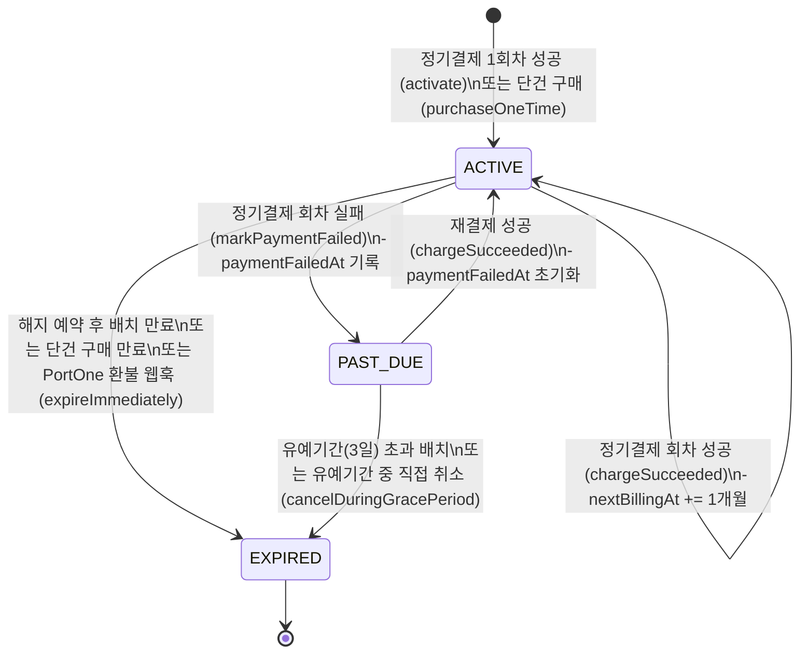

# 구독 상태 전이

## 상태 정의

| 상태 | 설명 |
|------|------|
| `ACTIVE` | 정상 이용 중 |
| `PAST_DUE` | 정기결제 회차 실패 — 혜택 즉시 차단, 3일 유예기간 |
| `EXPIRED` | 구독 종료 (단건 만료, 해지, 웹훅 환불, 유예기간 초과) |

## 상태 전이 다이어그램

## 주요 전이 트리거

| 이벤트 | 트리거 | 전이 |
|--------|--------|------|
| 정기결제 1회차 성공 | `POST /subscription/recurring` | `[new]` → `ACTIVE` |
| 단건(1개월 이용권) 구매 | `POST /subscription/onetime` | `[new]` → `ACTIVE` (canceledAt 즉시 세팅) |
| 정기결제 재결제 성공 | `SubscriptionBillingScheduler` (매일 자정) | `ACTIVE` → `ACTIVE` |
| 정기결제 회차 실패 | `SubscriptionBillingScheduler` | `ACTIVE` → `PAST_DUE` |
| 재결제 성공 | `SubscriptionBillingScheduler` | `PAST_DUE` → `ACTIVE` |
| 유예기간(3일) 초과 | `SubscriptionExpirationScheduler` | `PAST_DUE` → `EXPIRED` |
| 해지 예약 + 만료일 도달 | `SubscriptionExpirationScheduler` | `ACTIVE` → `EXPIRED` |
| 유예기간 중 직접 취소 | `DELETE /subscription` | `PAST_DUE` → `EXPIRED` |
| PortOne 환불 웹훅 | `POST /payments/webhook` | 즉시 `EXPIRED` |

## 권한 연동

- 펫 등록(`POST /pets`), 사진 업로드(`POST /pets/:id/photos`)는 `status = ACTIVE` 인 Subscription 보유 시에만 허용
- `PAST_DUE` 전환 시 혜택 즉시 차단 (`isReady()` 체크 또는 SUBSCRIBER role 제거)
- `profile_layout` 변경은 프론트 SUBSCRIBER 체크로만 제한 (API는 인증만 요구)
