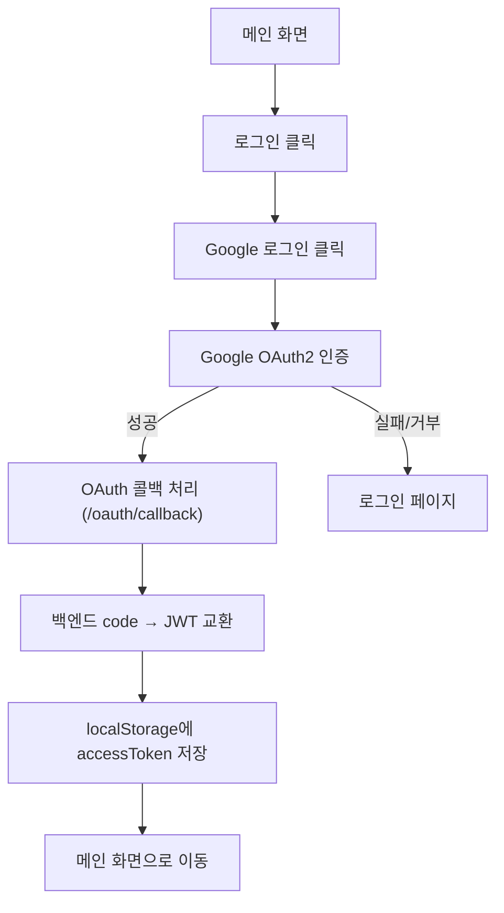
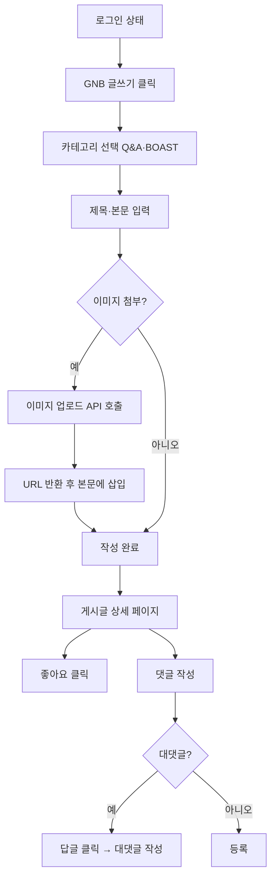
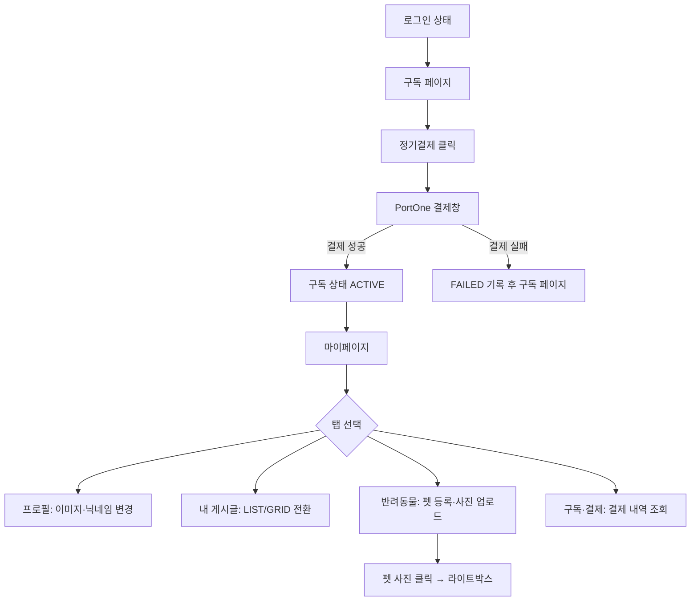

# 사용자 흐름

## 원본
- Notion: https://app.notion.com/p/User-Flow-3ad73873401a80099fdeddf2028f60c6

## 주요 흐름 1 — 소셜 로그인

```mermaid
flowchart TD
    A[메인 화면] --> B[로그인 클릭]
    B --> C[Google 로그인 클릭]
    C --> D[Google OAuth2 인증]
    D -->|성공| E["OAuth 콜백 처리 (/oauth/callback)"]
    E --> F[백엔드 code → JWT 교환]
    F --> G[localStorage에 accessToken 저장]
    G --> H[메인 화면으로 이동]
    D -->|실패/거부| I[로그인 페이지]
```

## 주요 흐름 2 — 게시글 작성 및 상호작용

```mermaid
flowchart TD
    A[로그인 상태] --> B[GNB 글쓰기 클릭]
    B --> C[카테고리 선택 Q&A·BOAST]
    C --> D[제목·본문 입력]
    D --> E{이미지 첨부?}
    E -->|예| F[이미지 업로드 API 호출]
    F --> G[URL 반환 후 본문에 삽입]
    G --> H[작성 완료]
    E -->|아니오| H
    H --> I[게시글 상세 페이지]
    I --> J[좋아요 클릭]
    I --> K[댓글 작성]
    K --> L{대댓글?}
    L -->|예| M[답글 클릭 → 대댓글 작성]
    L -->|아니오| N[등록]
```

## 주요 흐름 3 — 구독 결제 및 마이페이지

```mermaid
flowchart TD
    A[로그인 상태] --> B[구독 페이지]
    B --> C[정기결제 클릭]
    C --> D[PortOne 결제창]
    D -->|결제 성공| E[구독 상태 ACTIVE]
    D -->|결제 실패| F[FAILED 기록 후 구독 페이지]
    E --> G[마이페이지]
    G --> H{탭 선택}
    H --> I[프로필: 이미지·닉네임 변경]
    H --> J[내 게시글: LIST/GRID 전환]
    H --> K[반려동물: 펫 등록·사진 업로드]
    H --> L[구독·결제: 결제 내역 조회]
    K --> M[펫 사진 클릭 → 라이트박스]
```
