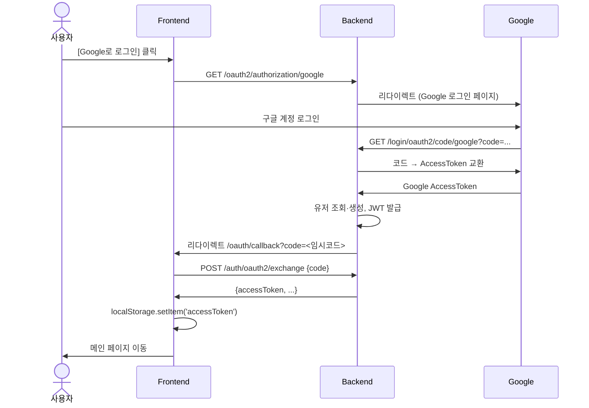
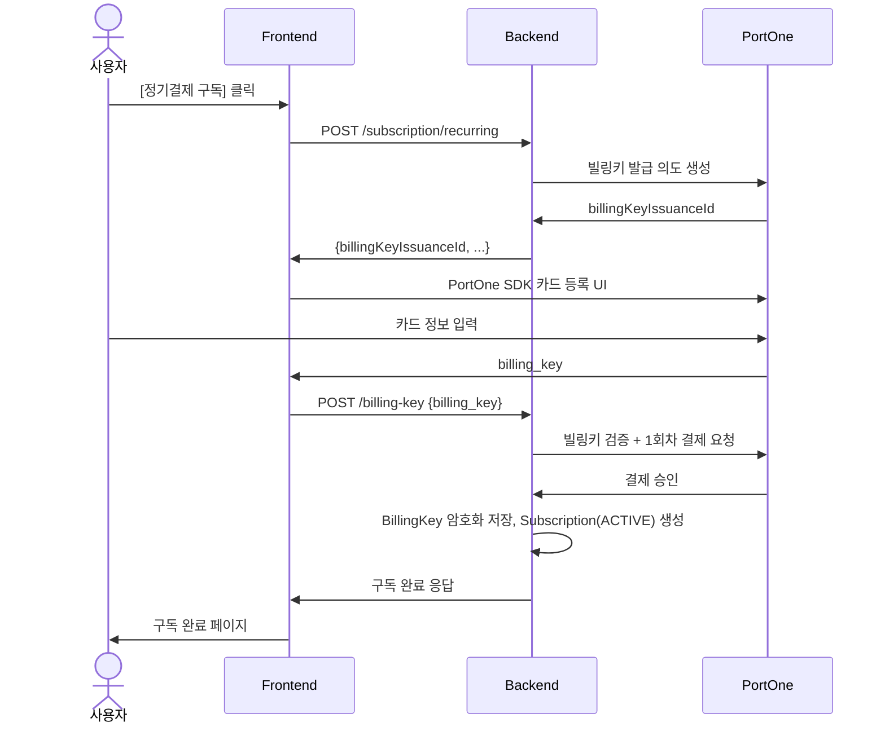
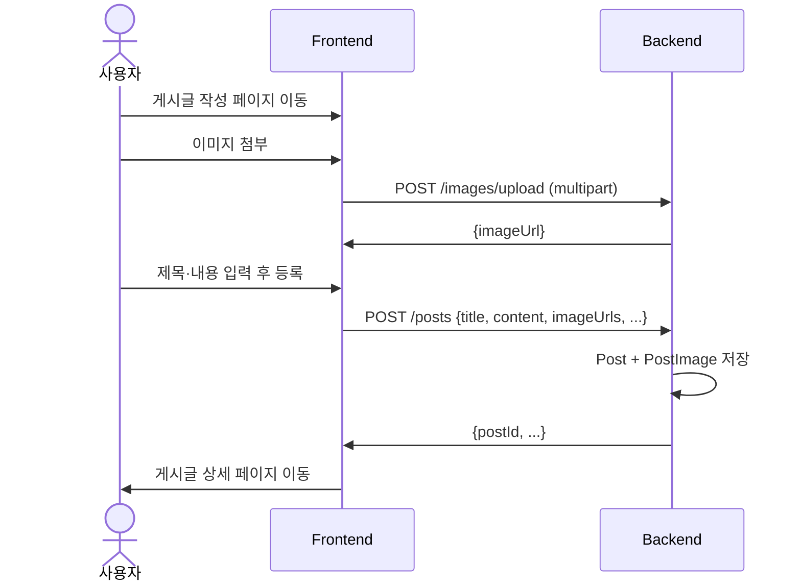

# 시퀀스 다이어그램

## 원본
- Notion: https://app.notion.com/p/3c773873401a80418950cfdb7759a38e

## Google OAuth2 로그인 시퀀스

```mermaid
sequenceDiagram
    actor U as 사용자
    participant F as Frontend
    participant B as Backend
    participant G as Google

    U->>F: [Google로 로그인] 클릭
    F->>B: GET /oauth2/authorization/google
    B->>G: 리다이렉트 (Google 로그인 페이지)
    U->>G: 구글 계정 로그인
    G->>B: GET /login/oauth2/code/google?code=...
    B->>G: 코드 → AccessToken 교환
    G->>B: Google AccessToken
    B->>B: 유저 조회·생성, JWT 발급
    B->>F: 리다이렉트 /oauth/callback?code=<임시코드>
    F->>B: POST /auth/oauth2/exchange {code}
    B->>F: {accessToken, ...}
    F->>F: localStorage.setItem('accessToken')
    F->>U: 메인 페이지 이동
```

## 정기결제 구독 시퀀스

```mermaid
sequenceDiagram
    actor U as 사용자
    participant F as Frontend
    participant B as Backend
    participant P as PortOne

    U->>F: [정기결제 구독] 클릭
    F->>B: POST /subscription/recurring
    B->>P: 빌링키 발급 의도 생성
    P->>B: billingKeyIssuanceId
    B->>F: {billingKeyIssuanceId, ...}
    F->>P: PortOne SDK 카드 등록 UI
    U->>P: 카드 정보 입력
    P->>F: billing_key
    F->>B: POST /billing-key {billing_key}
    B->>P: 빌링키 검증 + 1회차 결제 요청
    P->>B: 결제 승인
    B->>B: BillingKey 암호화 저장, Subscription(ACTIVE) 생성
    B->>F: 구독 완료 응답
    F->>U: 구독 완료 페이지
```

## 게시글 작성 시퀀스

```mermaid
sequenceDiagram
    actor U as 사용자
    participant F as Frontend
    participant B as Backend

    U->>F: 게시글 작성 페이지 이동
    U->>F: 이미지 첨부
    F->>B: POST /images/upload (multipart)
    B->>F: {imageUrl}
    U->>F: 제목·내용 입력 후 등록
    F->>B: POST /posts {title, content, imageUrls, ...}
    B->>B: Post + PostImage 저장
    B->>F: {postId, ...}
    F->>U: 게시글 상세 페이지 이동
```
